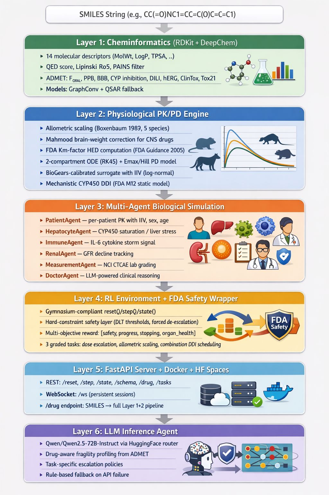

# RxGym — A Gymnasium-Compliant RL Environment for Drug Trial Lifecycle Optimization

> **The first OpenEnv environment that bridges cheminformatics, physiological simulation, and reinforcement learning into a single drug-trial optimization pipeline — starting from a SMILES string, ending at an FDA-compliant Phase I recommendation.**

RxGym doesn't simulate a toy grid-world. It simulates the actual decision-making chain that a clinical pharmacologist faces: take a molecule, predict its ADMET properties, translate an animal dose to humans using allometric scaling, escalate through a Phase I trial with real PK/PD dynamics, manage drug-drug interactions in combination regimens — all under hard FDA safety constraints that can override the agent's actions.

---

## Why This Exists

Nature Digital Medicine (2025) explicitly calls for *"validated, scalable frameworks combining RL-driven protocol optimization with adaptive trial designs"* — and notes that **such frameworks do not yet exist**. RxGym is a direct answer to that call.

Clinical trials are the slowest, most expensive, and most failure-prone step in drug development. A single Phase I→III pipeline costs **$1–2 billion** and takes **10–15 years**. The core decisions — what dose to start, when to escalate, when to stop — are still made by heuristic rules from the 1990s (3+3 designs). RL can do better, but there's no realistic training environment. RxGym fills that gap.

---

## Architecture: 6 Layers, One Pipeline



The architecture diagram above shows how RxGym connects six distinct layers into a single end-to-end pipeline. It starts at the top with a raw **SMILES string** — the standard text representation of a molecule — and flows downward through each layer:

- **Layer 1 (Cheminformatics)** computes 14 molecular descriptors via RDKit and predicts ADMET properties (oral bioavailability, CYP inhibition, toxicity flags) using DeepChem's GraphConv models with a QSAR fallback.
- **Layer 2 (Physiological PK/PD Engine)** translates those molecular properties into pharmacokinetic parameters using allometric scaling across 5 species (mouse → rat → monkey → dog → human), solves a 2-compartment ODE for drug concentration dynamics, and models CYP450-mediated drug-drug interactions following the FDA M12 guidance.
- **Layer 3 (Multi-Agent Biological Simulation)** spawns a population of virtual patients, each with individual variability. Inside every patient, four sub-agents — HepatocyteAgent (liver stress), ImmuneAgent (cytokine response), RenalAgent (kidney function), and a DoctorAgent (LLM-powered clinical reasoning) — observe the physiological state and emit structured signals.
- **Layer 4 (RL Environment + FDA Safety Wrapper)** wraps everything into a Gymnasium-compliant interface. An irremovable FDA safety layer enforces hard stopping rules (DLT thresholds, forced de-escalation) that override the agent's actions. The multi-objective reward scores each step on safety, progress, stopping quality, and organ health.
- **Layer 5 (FastAPI Server + Docker + HF Spaces)** exposes the environment as a production-ready REST and WebSocket API. The `/drug` endpoint accepts any SMILES string and runs the full Layer 1+2 pipeline to configure a molecule-specific trial.
- **Layer 6 (LLM Inference Agent)** drives the trial decisions using Qwen 72B via HuggingFace, with drug-aware fragility profiling from ADMET predictions and task-specific escalation policies.

Each layer feeds its output directly into the next — molecular descriptors become PK parameters, PK parameters drive patient simulations, patient signals shape rewards, and rewards train the agent. Nothing is hardcoded; everything traces back to the input molecule.


---

## Three Novel Contributions

### 1. Species-Bridging PK/PD as the Transition Model

No existing RL environment models the **translation gap** between animal and human pharmacology. RxGym does:

- The `AllometricScaler` implements power-law scaling (Boxenbaum 1982) with per-parameter exponents across **5 species** (mouse, rat, monkey, dog, human)
- CNS drugs get the **Mahmood brain-weight correction** (1996)
- FDA Km-factor HED computation follows the **2005 FDA Guidance for Industry**
- The agent must learn that animal-derived parameters are informative but systematically biased — and correct for that bias

### 2. Hard-Constraint FDA Safety Layer (Not Soft Reward)

Most RL safety work folds constraints into the reward function. That doesn't model reality — an ethics board doesn't negotiate with your reward signal. RxGym implements **irremovable safety wrappers**:

- If DLT rate exceeds 33% → **forced de-escalation** (agent's action is silently overridden)
- If ≥2/3 DLTs in a 3-patient cohort → **forced de-escalation**
- If ≥3/6 DLTs in a 6-patient expansion → **trial termination**
- Maximum dose ceiling: 50 mg/kg absolute cap
- These constraints are **not in the reward** — they are a `Gymnasium.Wrapper` that intercepts `step()` before the environment sees it

### 3. Multi-Objective Reward with Organ-Level Signals

The reward isn't a single number — it's a weighted composition of clinically meaningful objectives:

| Component | Weight | Signal Source |
|-----------|--------|---------------|
| **Safety** | 40% | DLT count, FDA stopping rules |
| **Progress** | 35% | Distance to molecule-specific target dose |
| **Stopping Quality** | 15% | Precision of RP2D identification |
| **Organ Health** | 10% | HepatocyteAgent + RenalAgent signals |

Plus a **+0.15 RP2D bonus** when the agent correctly identifies the recommended Phase II dose.

---

## Graded Tasks

### `phase_i_dosing` — Easy

Run a 3+3 dose-escalation from a molecule-derived starting dose. Find the RP2D.

The agent receives: plasma concentration, DLT counts/grades, organ signals from hepatocyte/immune/renal sub-agents, and a natural-language recommendation from the LLM DoctorAgent. Scoring is based on proximity to the drug-specific HED target (±10% = 1.0, ±25% = 0.8, ±50% = 0.5), with penalties for triggering FDA safety stops and bonuses for trial speed.

### `allometric_scaling` — Medium

Start from a rat reference dose. Predict the human-equivalent dose using allometric scaling, then refine it from observed human PK response.

The agent must propose a first-in-human dose close to the allometric HED anchor, then iteratively correct using actual patient data. Scoring rewards first-dose accuracy and penalizes overshoot — because in real Phase I trials, overshooting kills patients.

### `combo_ddi` — Hard

Manage a two-drug regimen where Drug A inhibits Drug B's CYP3A4 metabolism, increasing Drug B's exposure.

The environment implements **mechanistic CYP450 DDI** following the FDA M12 guidance:
- `CL_B_eff = CL_B × [fm_3A4 / (1 + [A]_free / Ki_A) + (1 - fm_3A4)]`
- DDI severity tiers: Weak (≥1.25× AUC), Moderate (≥2×), Strong (≥5×)
- The agent must find a safe, efficacious combination while managing temporal dose separation

---

## Molecule-Derived Parameters (Not Hardcoded)

Every parameter in RxGym traces back to the input molecule's SMILES string:

```
SMILES: CC(=O)NC1=CC=C(O)C=C1  (Acetaminophen)
  ↓ RDKit
14 molecular descriptors (MolWt=151.16, LogP=0.46, TPSA=49.33, ...)
  ↓ DeepChem GraphConv + QSAR fallback
ADMET profile (F_oral=0.87, PPB=0.25, DILI_flag=True, CYP3A4_inhib=0.12, ...)
  ↓ Allometric Scaler
PK parameters (CL=18.2 L/h, Vc=42.1 L, ka=1.2 h⁻¹, ...)
  ↓ FDA Km-factor
HED = 10 mg/kg × (6/37) = 1.62 mg/kg → starting dose = HED/10
```

This means **every task run is molecule-specific**. The same agent policy faces different dynamics for aspirin vs. diazepam vs. a novel compound. The environment isn't a fixed MDP — it's a family of MDPs parameterized by molecular structure.

---

## Biological Multi-Agent Layer

Each patient in a cohort is not just a number — they're simulated by a `PatientAgent` with:

- **Inter-individual variability**: `CL_i = CL_pop × exp(η)` (log-normal IIV, standard NONMEM model)
- **Demographic effects**: weight-scaled volumes, sex-adjusted distribution (0.85× for hydrophilic drugs in women), age-dependent CL decline (0.5%/year past 40)
- **DILI sensitivity**: if the molecule is DILI-flagged, liver stress multiplier doubles (2×)

Inside each patient, three biological sub-agents observe the PK state and emit structured signals:

| Sub-Agent | Signal | Mechanism |
|-----------|--------|-----------|
| **HepatocyteAgent** | CYP450 saturation [0,1] | Michaelis-Menten kinetics above AUC threshold |
| **ImmuneAgent** | Cytokine storm risk [0,1] | IL-6 level from Cmax (linear 5–20 mg/L) |
| **RenalAgent** | GFR fraction [1→0] | Kidney stress AUC (linear 100–400 mg/L·h) |

A **DoctorAgent** (LLM-powered, Qwen 72B) synthesizes all signals into a natural-language recommendation that becomes part of the RL agent's observation vector.

---

## Repository Layout

```
.
├── Dockerfile                          # Production image (Python 3.12-slim)
├── docker-compose.yml                  # API + inference + report profiles
├── inference.py                        # Competition entrypoint
├── openenv.yaml                        # OpenEnv task registry (3 graded tasks)
├── pyproject.toml                      # Package metadata
├── requirements.txt                    # Dependencies
│
├── rl_agent/                           # Core RL agent package
│   ├── inference.py                    # LLM-driven policy + scoring
│   ├── models.py                       # Pydantic action/observation schemas
│   ├── drug_profile_builder.py         # SMILES → full drug profile pipeline
│   └── server/
│       ├── app.py                      # FastAPI REST + WebSocket server
│       ├── agents.py                   # 6 agent types (Patient, Hepatocyte, ...)
│       ├── rl_agent_environment.py     # Gymnasium env + FDA safety wrapper
│       └── graders.py                  # Deterministic task grading
│
├── Patient_Simulation/                 # Physiological simulation engine
│   └── clinical_trial_gym/
│       ├── drug/
│       │   ├── molecule.py             # RDKit molecular descriptors + QED + PAINS
│       │   ├── admet.py                # DeepChem GraphConv + QSAR ADMET prediction
│       │   └── properties.py           # 29D feature vector + risk scoring
│       ├── pk_pd/
│       │   ├── allometric_scaler.py    # 5-species scaling + Mahmood correction
│       │   ├── surrogate_ode.py        # 2-compartment PK + Emax PD + DDI
│       │   └── patient_agent.py        # IIV population sampling + CTCAE grading
│       ├── envs/
│       │   ├── phase_i_env.py          # Phase I Gymnasium env (39D obs)
│       │   ├── allometric_env.py       # Allometric scaling env
│       │   └── combo_ddi_env.py        # Combination DDI env (84D obs)
│       └── science/
│           └── trial_priors.py         # Drug-specific Bayesian priors
│
└── scripts/
    ├── docker-entrypoint.sh
    └── validate-submission.sh
```

---

## Quick Start

### Local Development

```bash
python -m venv .venv && source .venv/bin/activate
pip install -r requirements.txt
pip install -e ./rl_agent
uvicorn rl_agent.server.app:app --host 0.0.0.0 --port 8000
```

### Configure a Molecule (from any SMILES)

```bash
curl -X POST http://localhost:8000/drug \
  -H "Content-Type: application/json" \
  -d '{"smiles": "CC(=O)NC1=CC=C(O)C=C1", "name": "Acetaminophen"}'
```

Returns: HED, starting dose, full ADMET profile, safety flags, PK parameters.

### Run Inference

```bash
export API_BASE_URL="https://router.huggingface.co/v1"
export MODEL_NAME="Qwen/Qwen2.5-72B-Instruct"
export HF_TOKEN="..."
python inference.py
```

### Docker

```bash
docker build -t rxgym .
docker run --rm -p 8000:8000 rxgym
```

---

## Live Demo

The environment is deployed on Hugging Face Spaces and can be accessed directly:

| Interface | URL | Description |
|-----------|-----|-------------|
| **Visual Dashboard** | [simransota-clinical-trial-env.hf.space/dashboard](https://simransota-clinical-trial-env.hf.space/dashboard) | Gradio UI with preset drugs, one-click trial simulation, and 6-panel visualizations |
| **OpenEnv Playground** | [simransota-clinical-trial-env.hf.space](https://simransota-clinical-trial-env.hf.space/) | Interactive API playground — type actions, see observations, step through a trial |
| **API Endpoints** | [simransota-clinical-trial-env.hf.space/docs](https://simransota-clinical-trial-env.hf.space/docs) | Swagger/OpenAPI documentation for all REST endpoints |

### For Evaluators

The fastest way to evaluate RxGym:

1. Open the **[Visual Dashboard](https://simransota-clinical-trial-env.hf.space/dashboard)**
2. Select a preset drug from the dropdown (Acetaminophen, Naproxen, Diazepam, Aspirin, or Ibuprofen) — or choose **"Custom"** and enter any SMILES string
3. Click **"Run Trial Simulation"**
4. Explore the 6 visualization panels and the episode summary

No setup, no API keys, no Docker — just click and explore.

---

## Trial Visualizations

The Gradio dashboard generates six clinical visualization panels after each simulated trial. Each panel provides a different lens into the trial dynamics, mirroring the data a real clinical pharmacologist would review.

### 1. Dose Escalation Trajectory

Tracks the dose (mg/kg) at each trial step. Each point is color-coded by safety status:

- **Green** — no DLTs observed, safe to escalate
- **Amber** — DLTs detected but below the FDA stopping threshold
- **Red** — FDA boundary reached (>33% DLT rate)

A dashed green line marks the **RP2D estimate** (Recommended Phase II Dose) — the highest dose that didn't trigger a safety stop. The ideal trial shows a controlled staircase that plateaus near the RP2D line.

### 2. PK Concentration-Time Curves

Displays the full 24-hour pharmacokinetic profile for every patient in every cohort. Each step gets a distinct shade (light → dark blue as dose escalates). The curves show:

- **Absorption phase** — drug entering the bloodstream (rising limb)
- **Distribution/elimination** — drug clearing via hepatic metabolism and renal excretion (falling limb)
- **Peak Cmax** — marked with a red dashed line at the highest concentration observed across all patients

These curves are generated from the 2-compartment ODE (with per-patient inter-individual variability), so different patients at the same dose produce slightly different profiles — exactly as in a real clinical trial.

### 3. DLT Grade Heatmap

A step-by-patient matrix showing the **NCI CTCAE toxicity grade** for each patient:

| Grade | Meaning | Color |
|-------|---------|-------|
| 0 | No toxicity | Green |
| 1 | Mild | Light green |
| 2 | Moderate | Amber |
| 3 | Severe (**DLT**) | Red |
| 4 | Life-threatening (**DLT**) | Dark red |

Grades 3+ are **Dose-Limiting Toxicities** — the critical safety events that determine whether escalation continues or stops. This heatmap lets you see exactly which patients experienced toxicity and at which dose level.

### 4. Organ Safety Signals

Three time-series from the biological sub-agents monitoring organ health throughout the trial:

- **Liver Stress** (orange, HepatocyteAgent) — CYP450 enzyme saturation. Rises as AUC accumulates above the Michaelis-Menten threshold. Values >0.7 indicate dangerous hepatic overload.
- **Immune Response** (purple, ImmuneAgent) — IL-6 cytokine signal. Triggered when plasma concentration exceeds 5 mg/L. Values approaching 1.0 indicate cytokine storm risk.
- **Renal Function** (blue, RenalAgent) — GFR fraction. Starts at 1.0 (healthy) and declines as kidney stress accumulates. Values <0.5 indicate significant renal impairment.

A red dashed danger threshold at 0.7 highlights when organ signals enter the critical zone. These signals directly feed into the RL reward function's organ health component (10% weight).

### 5. Reward Trajectory

Dual-axis chart showing:

- **Blue bars** — per-step reward (the 4-component weighted score: 40% safety + 35% progress + 15% stopping + 10% organ health)
- **Red line** — cumulative reward across the episode

A well-run trial shows increasing step rewards as the agent approaches the target dose, with a possible dip when DLTs are first encountered (the agent should then de-escalate). The cumulative line reveals overall trial quality at a glance.

### 6. Drug & Episode Summary

An HTML panel displaying:

- **PK Parameters** — human-scaled ka, CL, Vc, Vp, PPB (computed from the molecule's SMILES via RDKit + DeepChem + allometric scaling)
- **Safety Flags** — DILI risk, hERG risk, CYP inhibitions, overall risk score (from the ADMET prediction pipeline)
- **Episode Metrics** — starting dose, RP2D estimate, total steps taken
- **Task Scores** — final scores for all three graded tasks (phase_i_dosing, allometric_scaling, combo_ddi)

---

## Technical References

- **Boxenbaum (1982)** — Interspecies scaling, allometric parameters
- **Mahmood & Balian (1996)** — Brain-weight correction for CNS drug scaling
- **FDA Guidance for Industry (2005)** — Km-factor table for HED estimation
- **FDA M12 Guidance (2024)** — Static DDI model for competitive CYP inhibition
- **FDA Project Optimus (2024)** — Dose optimization framework for oncology
- **NCI CTCAE v5.0** — Common Terminology Criteria for Adverse Events (DLT grading)
- **NONMEM Population PK** — Inter-individual variability via exponential error model
- **Nature Digital Medicine (2025)** — Call for RL-driven adaptive trial frameworks

---

## OpenEnv Compliance

| Requirement | Status |
|------------|--------|
| `openenv.yaml` with tasks + graders | 3 tasks, 3 graders |
| FastAPI server with `/reset`, `/step`, `/state`, `/schema` | All implemented |
| Typed Pydantic action/observation models | `RlAgentAction`, `RlAgentObservation` |
| Root-level `inference.py` with `[START]`/`[STEP]`/`[END]` logging | Implemented |
| Root-level `Dockerfile` | Python 3.12-slim with healthcheck |
| HF Spaces metadata + `openenv` tag | In README frontmatter |
| Scores strictly in (0, 1) | Clamped with open-interval guard |

---

*RxGym turns drug development's most expensive guesswork into a tractable optimization problem — grounded in real pharmacology, constrained by real regulations, and parameterized by real molecules.*
